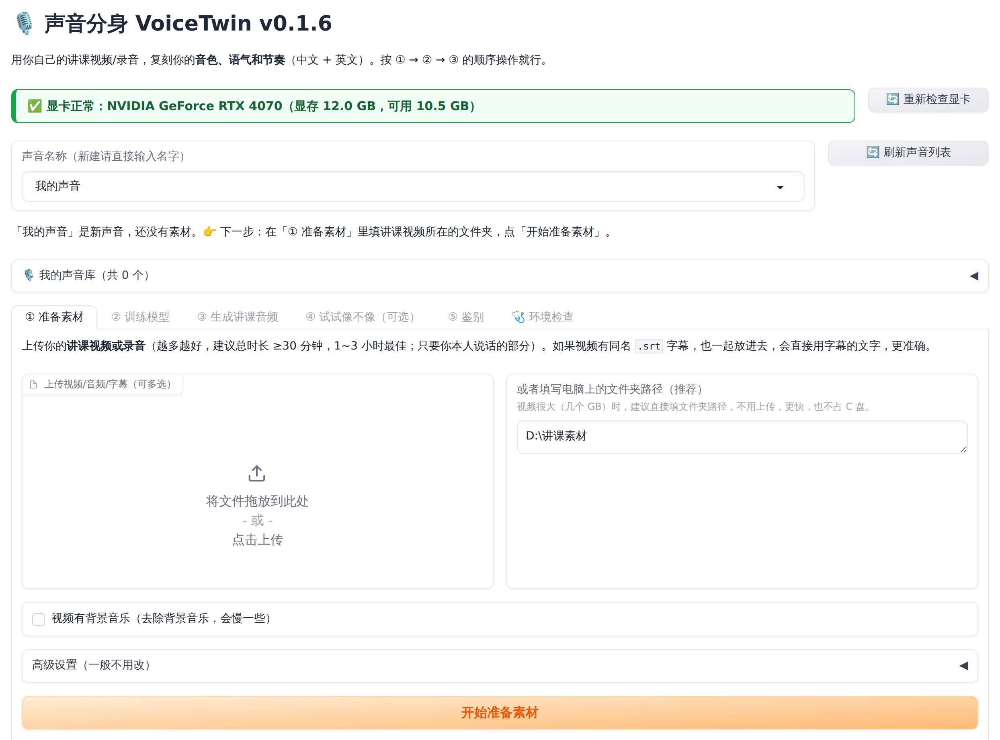
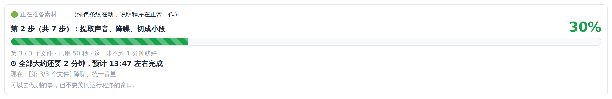
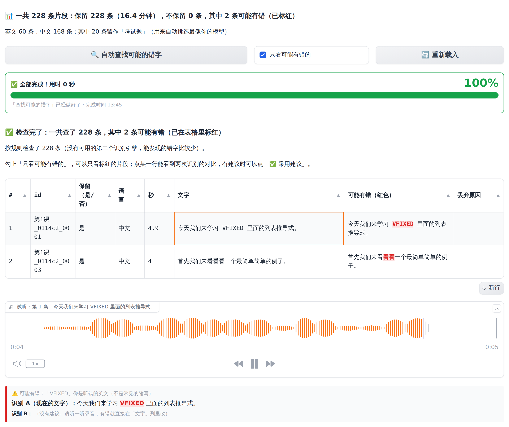
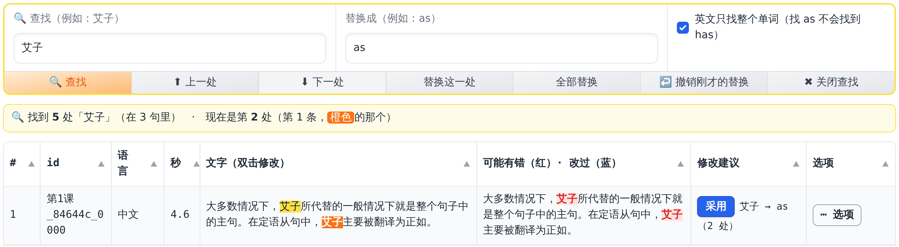
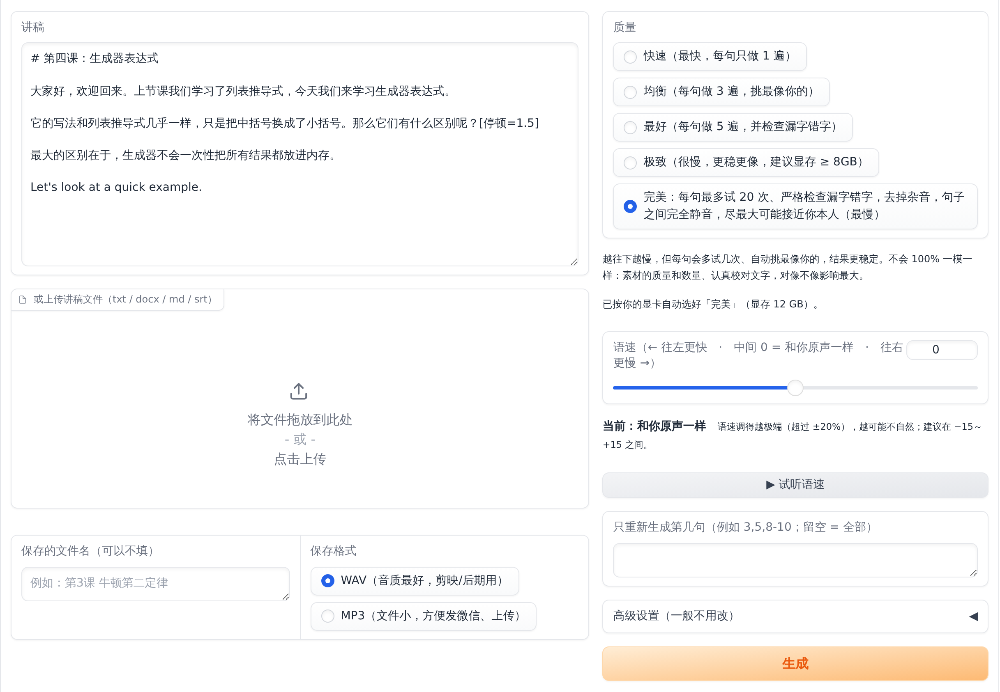
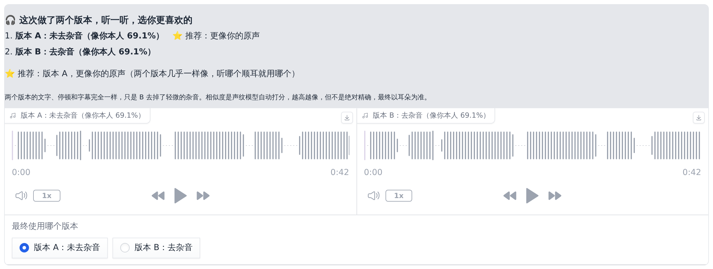
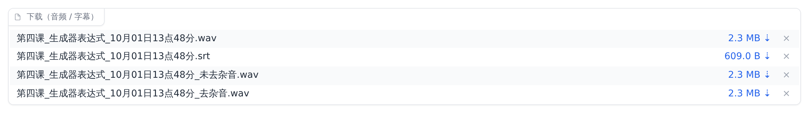

# 声音分身 VoiceTwin 快速上手

**只讲最重要的，10 分钟看完。** 一共三件事：**安装（一次）→ 训练你的声音（一次）→ 生成讲课音频（以后每次）**。

## 准备

- Windows 10 / 11 电脑，**NVIDIA 显卡**（显存 6GB 以上），D 盘空出 **30GB**
- 你以前录的**讲课视频**（嗓子正常时录的，**30 分钟以上**，1~3 小时最好）
- 解压软件 **7-Zip**：打开 <https://www.7-zip.org/>，点第一个 Download，安装

> **已经装过旧版本？升级只要 3 步，声音和训练好的模型都不会丢：**
> ① 下载新的 `VoiceTwin-Windows-v….zip`，右键 → 全部解压缩 → 位置填 `D:\`，提示有同名文件时选**替换**；
> ② 双击 `D:\VoiceTwin\install_windows.bat`，输入 `1`，再输入 `D:\GPT-SoVITS`；
> ③ 看到 **"✅ 安装成功！"** 后，它会问"现在就打开声音分身吗？"，直接按回车就会打开，黑色窗口里写着新版本号（例如「声音分身 VoiceTwin v18.5 正在启动」）就对了，网页标题永远显示 v18（标题右边还会显示你正在用的模型型号，例如 **模型：GPT-SoVITS v2ProPlus**，是从你的模型文件里读出来的）。

---

## 一、安装（只做一次，约 30~60 分钟）

**第 1 步　下载两个东西**

- **声音分身**：打开 <https://github.com/AlienCodes/literate-enigma/releases/latest>，点 **`VoiceTwin-Windows-v….zip`** 下载
- **GPT-SoVITS 整合包**：打开[官方下载页](https://www.yuque.com/baicaigongchang1145haoyuangong/ib3g1e/dkxgpiy9zb96hob4#KTvnO)，下载**最新的 v2pro 整合包**（`.7z` 文件，好几个 GB；RTX 50 系列显卡选文件名带 `nvidia50` 的）

**第 2 步　解压到 D 盘**

- 整合包：右键 → 7-Zip → 解压，把解压出来的文件夹改名为 **`GPT-SoVITS`**，放到 D 盘，也就是 **`D:\GPT-SoVITS`**
- 声音分身：右键 → 全部解压缩 → 位置填 **`D:\`**，得到 **`D:\VoiceTwin`**

**第 3 步　运行安装程序**

1. 双击 **`D:\VoiceTwin\install_windows.bat`**
2. 问"请输入 1 或 2"：输入 **`1`**，按回车
3. 问"整合包路径"：输入 **`D:\GPT-SoVITS`**，按回车（如果显示"找到了整合包：D:\GPT-SoVITS"，直接按回车就行）
4. 等它自己装完（窗口里滚动英文是正常的，**别关窗口**），看到 **"✅ 安装成功！"** 后，它会问"现在就打开声音分身吗？"，按回车就会打开
5. 桌面出现 **"声音分身 VoiceTwin"** 图标 = 装好了 ✅

> 如果安装最后的检查里有 ❌"缺少预训练模型"：先按第 5 步打开程序，点 **🩺 环境检查** 页面的
> **⬇️ 下载缺少的模型**，等进度条走到 100% 即可。

---

## 二、训练你的声音（只做一次，电脑自动完成，约 1~3 小时）

**第 4 步　放素材**：在 D 盘新建文件夹 **`讲课素材`**，把你以前的讲课视频**复制**进去。

**第 5 步　打开程序，先看显卡**：双击桌面 **"声音分身 VoiceTwin"**，等浏览器自动打开（**黑色窗口不要关**，最小化就行）。

页面最上面有一条**显卡状态**，一直显示着：

- 🟩 **绿色"✅ 显卡正常"** = 一切正常，继续往下做
- 🟥 **红色"❌ 显卡没有正常工作"** = 先照着红条里"怎么办"做（一般是到 [NVIDIA 官网](https://www.nvidia.cn/drivers/lookup/) 装最新显卡驱动，**重启电脑**），再点右边 **🔄 重新检查显卡**

**第 6 步　准备素材**

1. 最上面 **声音名称** 输入：`我的声音`
2. 在 **① 准备素材** 页面，"或者填写电脑上的文件夹路径"里填：`D:\讲课素材`
3. 点橙色按钮 **开始准备素材**

4. 下面会出现**进度条**，显示做到百分之几、第几步、已经用了多久、**大约几点做完**：
   - 🟩 **绿色** = 正在正常工作，等着就行
   - 🟨 **黄色** = 已经好几分钟没有新进度（第一次会下载识别模型，慢一点是正常的，先耐心等）
   - 🟥 **红色** = 出问题停下了，照着红条里的"怎么办"做
   - ✅ 走到 **100%、显示"全部完成"** = 做好了

5. 完成后下面会列出所有片段，每行**前面有编号**，表格上方写着**一共多少条、保留多少条（多少分钟）**

**第 6½ 步　找错字（推荐，5 分钟）**

1. 点 **🔍 自动查找可能的错字**，等进度条走完（以前查过的也再点一次）
2. 点 **📝 一键全部文字校正**：以你的**母本标准库**为准（你修缮过的讲课母本 + 所有语法术语 + 「借词 → 介词、艾子 → as」这样的对照表，程序里已经带着），把写错的字**一次全部改好**，「修改建议」也一起采用。改过的字"文字"里是**绿色**、旁边一列是**蓝色**；只标红、没有建议的还是**红色**，听录音自己改。点 **⬇️ 下载改好的文字（txt）** 可以把改好的文字一次存下来
3. 勾选 **只看可能有错的**：可能识别错的字是**红色**；点某一行可以试听。**修改建议**里的小按钮只改这一行：**蓝色**点一下按建议改好、**变红 = 生效了**（再点一下可以撤销）
4. 自己改：**双击"文字"那一格**，在大框里改好按**回车**。改过的字在"文字"里是**绿色**、旁边一列是**蓝色**
5. **同一个错字在很多句子里（像 Word 的查找替换）**：表格上面的 **🔍 查找** 框输入错字（例如"艾子"）按回车，只列出有这个字的句子（**黄色**，现在这一处**橙色**）；**替换成** 填正确的（例如"as"），点 **全部替换**，或者 **⬇ 下一处 / 替换这一处** 一处一处换。换错了点 **↩️ 撤销刚才的替换**，**✖ 关闭查找** 看全部
6. 不要的一行：**⋯ 选项 → 删除这一行**（会再问一次），整行变**紫色** = 不再算训练素材；删错了在 **⋯ 选项** 里点**撤销删除**。灰色的行是程序判断不能用的
7. 小灯：**🔴 = 改了没保存，🟢 = 已保存**。改完点最下面的 **保存修改**（或 **⋯ 选项 → 保存这一行**）
8. 最后点 **✅ 确认训练素材**（**不点不能训练**，确认后又改了要再点）：用来训练的句子**行号变橙色**，删除的、不能用的不显示行号；训练只用保存过的、改好的文字
9. 写着"**还没有识别出文字**"：识别没做完，**再点一次"开始准备素材"按钮**就会接着识别

**第 7 步　训练**

1. 点 **② 训练模型** 页面，什么都**不用改**：电脑会按你的显卡自动定好最合适的训练参数（页面上会写出来）
2. 点橙色按钮 **开始训练**，等进度条走到 100%、显示 **✅ 训练完成**（训练后又改了文字，要重新训练才生效）
3. 训练期间**别关电脑、别让电脑睡眠**（程序会尽量让电脑不睡眠，保险起见：设置 → 系统 → 电源 → 睡眠改成"从不"）

---

## 三、生成讲课音频（以后每次只做这 4 步）

**第 8 步**　双击桌面图标，在 **声音名称** 选 `我的声音`（或者在 **🎙️ 我的声音库** 里点一下它），点 **③ 生成讲课音频**

**第 9 步**　把讲稿**粘贴**到"讲稿"框里（或者在下面上传 txt / Word 文件）

**第 10 步**　设置，然后点橙色按钮 **生成**

- **质量**：电脑会按你的显卡自动选好，**显卡正常时默认就是「完美」**（每句最多试 20 次，挑最像你的，最慢）。只想先快速听个效果，可以选「均衡」
- **语速**：拉杆在 **0 = 和你原声一样**；**往左拉更快，往右拉更慢**，声音不会变。点 **▶ 试听语速** 先听一句（建议在 −15～+15 之间）

**第 11 步**　等进度条走到 100%，然后：

- 表格里每一句都有 **"像你本人（%）"**：**100% = 和你自己的真实录音一样像，0% = 陌生人**；低于 85% 的会标出来
- **「完美」档会做两个版本**：**A 未去杂音**、**B 去杂音**。电脑会自动比较哪个更像你，标 ⭐ 推荐。两个都听一听，在 **最终使用哪个版本** 里选你喜欢的
- 生成的声音**只有你的声音**：没有背景音、没有底噪，句子之间的停顿是**完全静音**

点 ▶ 试听；在"下载（音频 / 字幕）"里点文件名后面的大小（如 `2.1 MB ↓`）下载 **音频（.wav）** 和 **字幕（.srt）**，直接拖进剪映用

> 生成的文件也会自动保存在 `D:\VoiceTwin\workspace\我的声音\outputs` 文件夹里。

- **某几句不满意？** 看表格里这句的编号，在"只重新生成第几句"里填编号（例如 `3,5`），再点 **生成**，只重做这几句，很快。
- **想确认像不像？**（可选）**⑤ 鉴别** 页面：点 **开始鉴别**，电脑用几个声纹模型一起给每个生成的音频打分、排名（低于 85% 的会标出来），
  还会告诉你：你自己的真实录音一般在多少 % 之间；
  点 **生成盲听测试**，可以让同事、学生听，看他们能不能分出哪段是真人。

---

## 讲稿怎么写（记住 3 条就够）

1. **标点写对**：问句用问号，模型就会用提问的语气
2. **空一行 = 换一段**，停顿会稍长一点
3. **想停几秒**，就写 `[停顿=2]`（停 2 秒）

---

## 遇到问题

| 问题 | 怎么办 |
|---|---|
| 双击 `install_windows.bat` 窗口一闪就没了 | 在 `install_windows.ps1` 上右键 → 使用 PowerShell 运行 |
| 桌面上没有出现图标 | 在 `D:\VoiceTwin` 里右键 `start_webui.bat` → 发送到 → 桌面快捷方式（或者直接双击 `start_webui.bat`） |
| 安装窗口里的中文全变成「?」 | 关掉窗口，**直接双击** `install_windows.bat`（不要右键「以管理员身份运行」）。新版本（v0.1.9 起）会自动换成能显示中文的窗口或字体 |
| 页面最上面是红色"❌ 显卡没有正常工作" | 到 [NVIDIA 官网](https://www.nvidia.cn/drivers/lookup/) 装最新显卡驱动，**重启电脑**，再点 🔄 重新检查显卡（不装好训练会非常慢） |
| 进度条变成红色 | 看红条里的"原因"和"怎么办"照着做；"详细过程"里会自动写出**问题报告**，需要别人帮忙时把它发给他 |
| 进度条变成黄色很久不动 | 先等几分钟（下载模型、处理很长的视频时会这样）；超过半小时还不动，点 ⏹ 停止（5 秒内点两次），再重新点开始 |
| 浏览器没有自动打开 | 自己打开浏览器，地址栏输入 `127.0.0.1:7860` 回车 |
| 训练时提示显存不够（`out of memory`） | 程序会自动减小设置重试；还不行就在 ② 训练模型 → 高级设置 把"每批数量"改成 `2`，再点开始训练 |
| 某个字总是读错 | 用记事本打开 `D:\VoiceTwin\workspace\我的声音\lexicon.txt`，加一行 `行长 => 航长`（原文 => 读法），保存后重新生成 |
| 环境检查里"精准声纹打分"是黄色 | 点 **⬇️ 下载缺少的模型**（约 170 MB）。没下载时也能用，只是"像你本人"的打分准确度低一些 |
| 声音不够像 | 多放一些讲课视频（1~3 小时），删掉嗓子哑时的录音，做一次"找错字"，重新做第 6、7 步 |

其它问题：把 `D:\VoiceTwin\workspace\我的声音\logs` 里最新的「问题报告_….txt」发给帮你的人。

> 只克隆你自己的声音。公开发布 AI 合成的音频时，请按平台规定标注"AI 合成"。
